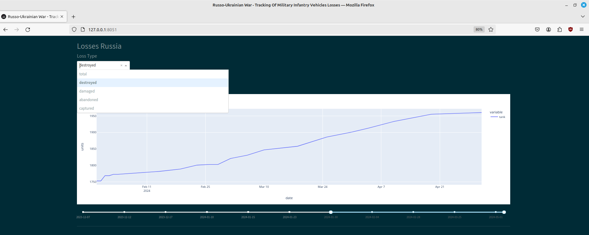
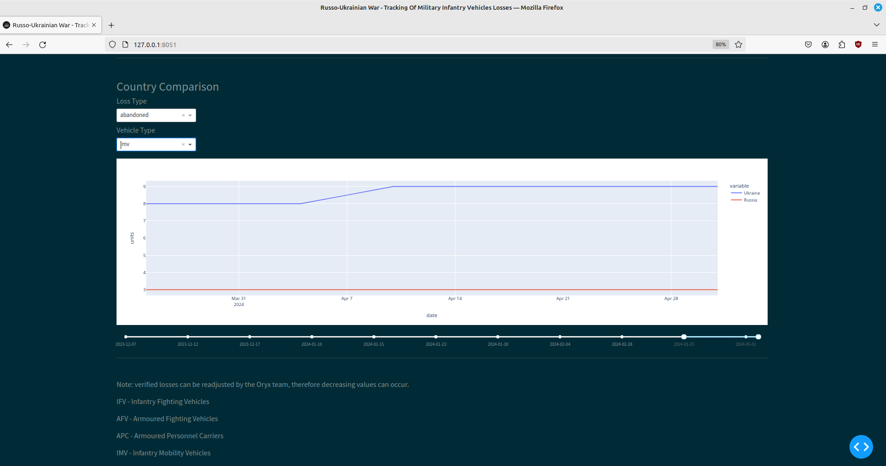

# Oryx War Losses - Tracking Daily Infantry Vehicles Losses In The Russo-Ukrainian War

An orchestrated data pipeline that pulls data from the web to feed an interactive dashboard.

## Table of Contents

- [Introduction](#introduction)
- [Interactive Dashboard View](#interactive-dashboard-view)
- [Features](#features)
- [Getting Started](#getting-started)
  - [Installation](#installation)
  - [Configuration](#configuration)
- [Usage](#usage)
- [License](#license)

## Introduction

This project is a data pipeline that automatically scrapes and stores on a daily basis a summary of infantry vehicle related losses resulting from the armed conflict between the Russian Federation and Ukraine started on the 24 of February, 2022. The data is taken from the Oryx website - a platform dedicated to collecting evidence and validating this type of occurrences, and pipelined to an interactive dashboard implementation that allows to visually observe and compare the evolution of such losses:
- Compare between types of losses: destroyed, damaged, abandoned, captured.
- Compare between types of vehicle lost: tanks, armoured fighting vehicles, etc.
- Compare ukrainian and russian losses vis-a-vis.

### Interactive Dashboard View

## Features

- Scraping process and database pipelining via Scrapy framework.
- Scraped data and environment variables validation with Pydantic. 
- MySQL database for data storage.
- SQLAlchemy for database setup and connection.
- Alembic for data model migration.
- Airflow for task orchestration.
- X Array for data processing.
- Plotly for data visualization.
- Dash for front-end dashboard implementation.
- Pytest for multiple purpose testing.   

##### Additional features:
- Implementation of a small mechanism that tells Airflow to mark a DAG run as a 'failure' if the Scrapy log catches non-critical errors before and after the current crawling/scraping/pipelining process. 

- Implementation of an auto-flusher for the Scrapy log file after 10 spider combined runs (two spiders, one that scrapes Ukraine related data end other that scrapes Russia related data, are run sequentially via the same `spider_runner` script, therefore, two logs are appended to the log file each cycle).      

##### Notes:
- This projects uses an airflow version for development - ['airflow standalone'](https://airflow.apache.org/docs/apache-airflow/stable/start.html), which uses a simpler implementation when compared to the production setup.

## Getting Started 

(For Linux machines)

Integrating Airflow into a project requires additional septs and considerations:

- [Poetry](https://python-poetry.org/) ins't compatible; regardless it is highly recommended to use a virtual environment with a dependency manager that automatically finds/'locks' package compatibility.

- The deployment of Airflow is usually made via a container/Docker framework; for development purposes, we can make it work via Python `venv`/`pipenv`. When activating a virtual environment via [Pipenv](https://pipenv.pypa.io/en/latest/index.html) environment variables are loaded in advance, enabling the Airflow root directory to be [recognized](https://stackoverflow.com/questions/56890937/how-to-use-apache-airflow-in-a-virtual-environment).   

### Installation

This installation process assumes that [MySQl](https://dev.mysql.com/doc/refman/8.0/en/postinstallation.html) has been installed locally. 

Install Pipenv:

        $ pip3 install --user pipenv

Create a virtual environment and install the required packages.

        $ cd path/to/project/root/folder
        $ pipenv install -r requirements/requirements.txt

Activate Pipenv shell and projets's virtual evironment.

        $ pipenv shell

Create database tables in the MySQL database with Alembic (it is assumed that the database schema has already been set on the server side):

        $ alembic upgrade head

#### Airflow setup:

Set two environment variables: `AIRFLOW_HOME` sets the `airflow` folder in the project's root folder path; adding both, project's root and airflow paths, to `PYTHONPATH`, allows the DAG script
to import modules outside de scope set in `airflow.cfg`.  

        $ echo "AIRFLOW_HOME=${PWD}/airflow" > .env
        $ echo "PYTHONPATH=${PWD}:${PWD}/airflow" >> .env

Create the Airflow folder inside the project root folder, initializes the database, creates a user, and starts all components; we deactivate and activate the virtual environment to enable Pipenv to load the environment variable:
        
        $ exit
        $ pipenv shell
        $ airflow standalone

The previous command sets up the path for the dag folder but it does not create it; the simple solution is to move the 'dags' folder provided in the project root folder, that already contains the DAG for this project, into the Airflow folder:
  
        $ mv dags airflow

#### Notes: 

- For Airflow to recognize the DAGs script inside the `dags` folder after relocation, it may be required to shut Airflow down and re-run `airflow standalone`. To avoid loading DAG examples provided by Airflow set `load_examples` to `False` inside `airflow.cfg`.

- To set a specific time for the DAG to run change the `schedule` parameter in `./airflow/dags/dag_scrapy_pipeline.py` (currently set to run daily at 2 p.m).

### Configuration

#### Environment variables

The project has two .env files: 

- As previously seen on the Airflow setup, one is located in the root folder:

        AIRFLOW_HOME=/path/to/airflow/root/folder

- The other .env file stores all other variables and is located outside the project's directory. It is load via the `env_model.py` script and its path can be assigned to the `dotenv_path` variable. The variables are:

        # MySQL server / database credentials.
        USER_NAME=
        SECRET_KEY=
        PORT=
        HOST=
        DATABASE=

## Usage

There are three 'runner' scripts:

Handled by Airflow:

- `spider_runner`: runs the spiders' jobs 
- `log_check_runner.py`: checks if previous runs had any errors during the execution.

Initiating the dashboard:

        $ python3 dashboard_runner.py 

## License

MIT License