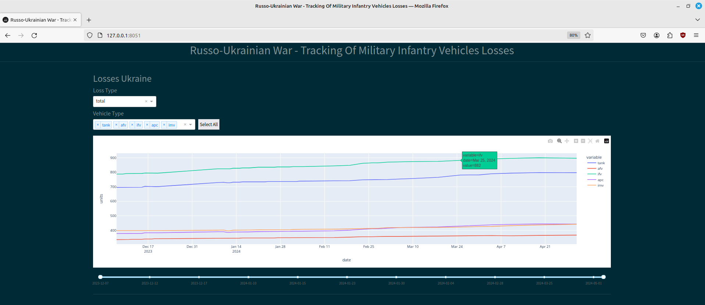

# Oryx War Losses - Tracking Daily Infantry Vehicles Losses In The Russo-Ukrainian War

An orchestrated data pipeline that pulls data from the web to feed a dashboard.

## Table of Contents

- [Introduction](#introduction)
- [Interactive Dashboard View](#interactive-dashboard-view)
- [Features](#features)
- [Getting Started](#getting-started)
  - [Installation](#installation)
  - [Configuration](#configuration)
- [Usage](#usage)
- [API Documentation](#api-documentation)
- [Contributing](#contributing)
- [License](#license)
- [Acknowledgments](#acknowledgments)

## Introduction

Data pipeline that scrapes and stores daily the summary of infantry vehicle war related losses (tanks, armoured vehicles, transport vehicles, etc.) from the Oryx website - a platform dedicated to the registration and validation of this type of events; the stored data feeds an interactive dashboard implementation that allows to visually observe the evolution of such losses.  

### Interactive Dashboard View

## Features

- Scraping process and database pipelining via Scrapy framework.
- Scraped data and environment variables validation with Pydantic. 
- MySQL database for data storage.
- SQLAlchemy for database setup and connection.
- Alembic for data model migration.
- Airflow for task orchestration.
- Pandas for data processing.
- Plotly for data visualization.
- Dash/Flask for front-end dashboard implementation.
- Pytest for multiple purpose testing.   

##### Additional features:
- Implementation of a small mechanism that tells Airflow to mark a DAG run as a 'failure' if the Scrapy log catches non-critical errors during the current crawling/scraping/pipelining process. 

- Implementation of an auto-flusher for the Scrapy log file after 10 spider (combined) runs - two spiders, one that scrapes Ukraine related data end other that scrapes Russia related data, are ran sequentially via the same `spider_runner` script, therefore, two logs are appended to the log file each cycle.      

##### Notes:
- This is a development version whose its deployment is not straightforward since it uses a development implementation of airflow ['airflow standalone'](https://airflow.apache.org/docs/apache-airflow/stable/start.html).

## Getting Started 

(For Linux machines)

Integrating Airflow into a project required installation additional septs and considerations:

- It is not [Poetry](https://python-poetry.org/) compatible; regardless it is highly recommended to use a virtual environment with a dependency manager that automatically finds package compatibility.

- The deployment of Airflow is usually made via a container/Docker framework; for development purposes, we can make it work is via Python `venv`/`pipenv`. When activating a virtual environment via [Pipenv](https://pipenv.pypa.io/en/latest/index.html), environment variables are loaded in advance, so that the Airflow root directory can be [recognized](https://stackoverflow.com/questions/56890937/how-to-use-apache-airflow-in-a-virtual-environment).   

### Installation

This installation process assumes that [MySQl](https://dev.mysql.com/doc/refman/8.0/en/postinstallation.html) has been installed locally. 

Install Pipenv:

    $ pip3 install --user pipenv

Create a virtual environment and install the required packages.

    $ cd /path/to/project/root/folder
    $ pipenv install -r /path/to/requirements.txt

Create database tables in the MySQL database with Alembic (it is assumed that the database schema has already been set on the server side):

    $ alembic upgrade head

After installing Airflow this additional package may be required to be installed:

    $ pip3 install apache-airflow[cncf.kubernetes]

Airflow setup:

- Activate Pipenv shell and projets's virtual evironment.

        $ pipenv shell

- Create Airflow folder inside the project root folder, initializes the database, creates a user, and starts all components:
        
        $ airflow standalone

- The previous command sets up the path for the dag folder but does not create it; the simple solution is to move the 'dags' folder I provide in the project root folder, that already contains the DAG for this project, into the Airflow folder:
  
        $ cd /path/to/project/root/folder
        $ mv dags airflow

#### Notes: 

- In order to Airflow to recognize the DAGs script inside the `dags` folder after relocation, it may be required to shut Airflow down and re-run `airflow standalone`.

- The Airflow DAG is set to run daily at 3 p.m.

### Configuration

#### Environment variables

The project has two .env files: 

- One that is visible and located in the root folder that enables `airflow standalone` to initiate and `airflow` folder in a desired location:

        AIRFLOW_HOME=/path/to/airflow/root/folder

- The other .env file stores all other variables and is located outside the project's directory. It is load via the `env_model.py` script and its path can be assigned to the `dotenv_path` variable. The variables are:

        # MySQL server / database credentials.
        USER_NAME=
        SECRET_KEY=
        PORT=
        HOST=
        DATABASE=

## Usage

There are three 'runner' scripts:

Handled by Airflow:

- `spider_runner`: runs the spiders' jobs 
- `log_check_runner.py`: checks if there were previous runs had any errors during the execution.

Initiating the dashboard:

        $ python3 dashboard_runner.py 

## License

MIT License